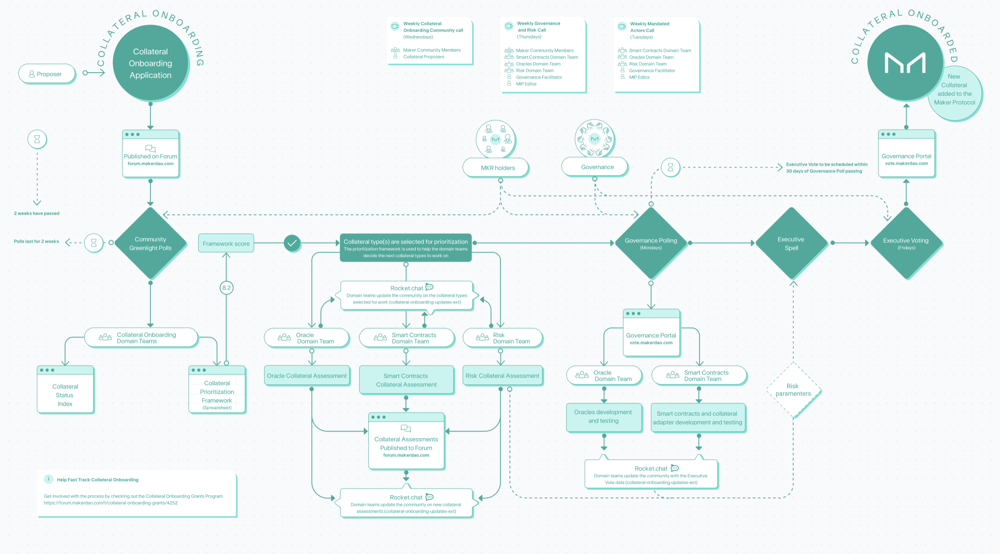

# Overview of the Collateral Onboarding Process

## **Introduction**

The Collateral Onboarding process is a crucial aspect of growing MakerDAO. Onboarding quality collateral assets to the Maker Protocol increases the demand for Dai, scales-up Dai supply, and ultimately helps mitigate risk while maintaining  Dai stability. Moreover, a formalized and public collateral onboarding process upholds the DAO’s principles of complete transparency and accountability to the Maker community. 

### Diagram Overview of the Collateral Onboarding Process 

## **High-Level Overview of the Collateral Onboarding Process**

**1. A Collateral Onboarding Application is completed and proposed to the MakerDAO community in the Maker Forum.**

* The Application will be discussed in the Forum over a two-week period before being eligible for a Community Greenlight Poll.

**2. Collateral Onboarding Community Greenlight Polls**

* Community Greenlight Polls allow holders of MKR,  the governance token of the Maker Protocolto signal their judgment on the value of a potential collateral type before domain teams thoroughly investigate that collateral type.
* Greenlight Polls last for two weeks.

**3. All collateral types greenlit are added to the Collateral Status Index and the** [**Collateral Onboarding Prioritization spreadsheet**](https://docs.google.com/spreadsheets/d/1IX9e2fyfz7djtDMKn5gMyGsyFxHoY75GncMbAjnSXrM/edit#gid=0)**.**

**4. Collateral onboarding domain teams use the Collateral onboarding prioritization framework to help determine the order in which assets are onboarded to the Maker Protocol.**

**5. Domain collateral assessments are created and published to the Maker Forum while awaiting the posting of a Governance Poll on the following Monday.**

* The domain collateral assessments are created by the MakerDAO Risk, Oracle, and Smart Contracts domain teams and contain in-depth evaluations of collateral types. The goal of the assessments is to provide information to help inform the MakerDAO governance community.
* Governance Polls allow MKR holders to signal their support or opposition to adding a collateral type to the Maker Protocol.

**6. If the Governance Poll passes, the domain teams finalize their respective work and an Executive Vote is scheduled to occur within 30 days; if the Poll does not pass, a request for a new governance poll may be resubmitted in the future.** 

* Typically, governance polls for collateral onboarding may be resubmitted only twice. Therefore, it is recommended that the community first investigate why a governance poll initially failed before proceeding with the resubmission.

**7. Once the required work of MakerDAO Risk, Oracle, and Smart Contracts domain teams is done, an Executive Spell is prepared.**

* The Executive Spell is a smart contract created for each Executive Vote. The smart contract contains logic that implements changes agreed to by voters in prior Governance polls. It’s important to note that the Executive Vote needs to pass in order to officially implement the changes in the Executive Spell to the Maker Protocol.

**8. The Executive Vote date is announced once the Executive Spell is complete.** 

* Collateral Onboarding Executive Votes will always occur on Fridays.

**9. If the Executive Vote passes, the collateral asset is added to the Maker Protocol; if it fails the collateral type has officially been rejected from being added to the Maker Protocol.** 

* As mentioned in step 7, governance polls for collateral onboarding may be resubmitted up to two times before not being eligible for resubmission. If a resubmitted governance poll passes, it will proceed to an Executive Vote once again. 

