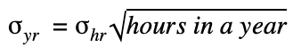

# Collateral Risk Assessment Guide

### **Directory** 

1. Overview
2. Note to Readers
3. Learning Objectives
4. Pre-requisites
5. Risk Domain Team Role
6. Risk Domain Team Process
7. Risk Assessment Process
8. Summary 
9. Resources

## **1. Overview**

This guide explains how to conduct a risk assessment of a collateral type that has been greenlit by the Maker Governance community to be onboarded to the Maker Protocol. 

## **2. Note to Readers**

**Important:** This guide has been developed based on work performed by previous and current members of the Risk Domain Team. It intends to capture a snapshot of how assessments are presently conducted. However, it does not preclude other risk teams from developing independent methods to evaluate and present risk-related concerns to the Community. Indeed, we hope that the insights presented here spur discussion on risk and inspire risk professionals to join and provide analysis for MakerDAO.

## **3. Learning Objectives**

* Understand the reasoning behind the collateral risk assessment process, as well as the data and methodology behind it.
* Learn how to conduct and present a risk assessment.

## **4. Pre-requisites**

* Clear understanding of the Maker Governance process \(see chapter on [Governance](https://collateral.makerdao.com/governance-and-collateral-onboarding/untitled)\)
* Adept understanding of risk modelling
* Adept understanding of working with data APIs
* Adept understanding of working with and analyzing large data sets

## **5. Risk Domain Team Role**

Risk Domain Teams are mandated by Maker Governance voters to properly assess the risk of collateral assets greenlit by MKR token holders to be onboarded to the Maker Protocol. Risk assessments are crucial because they influence the risk parameters set for each asset and, therefore, impact the overall risk contained in the Protocol and borne by MKR holders.

Failure to properly assess collateral asset risks can lead to unfit risk parameters, which could result in the system accruing debt that must be recapitalized through MKR dilution. Therefore, thorough risk assessments must be conducted to support a healthy protocol and help ensure that Maker Governance makes informed choices on how to set proper risk parameters.

## **6. Risk Domain Team Process**

The Risk Domain Team is just one of multiple domain contributors involved in the collateral onboarding process. The collateral onboarding process begins with the [MIP6](https://github.com/makerdao/mips/blob/Accepted/MIP6/mip6.md) \(Maker Improvement Proposal framework\) process. Once an asset has been greenlit by the community to be onboarded to the Maker Protocol, the domain teams start their respective asset-related work. For the risk domain team, this means creating a risk assessment consisting of a risk analysis and proposed risk parameters for the asset in the Maker Protocol. When completed, that assessment is posted to the Maker Forum for broad community discussion.

## **7. Risk Assessment Process**

The risk assessment process includes how to conduct risk analysis and create risk parameters. For Ethereum native assets \(i.e., ERC20— Ethereum protocol token assets\), the risk assessment should follow the [template for BAL](https://forum.makerdao.com/t/bal-collateral-onboarding-risk-evaluation/4600) \(Balancer token\). For stablecoins, the risk assessment should follow the [template for USDT/PAX](https://forum.makerdao.com/t/usdt-pax-collateral-onboarding-risk-evaluation/3723) \(Tether and Paxos\).

### **Content of the risk assessment**

**Each risk assessment must contain the following sections\* :**

1. **Overview and description of the protocol/product**
   1. Protocol Summary
   2. Tokenomics, if applicable
   3. On-chain fundamentals
      * Active addresses/users
      * Fees generated, if applicable
      * Other protocol/product specific fundamentals
2. **Metrics and analysis**
   1. CEX and DEX volumes \(ERC20 and stablecoins\)
   2. Holders distribution \(ERC20\)
   3. Supply inflation \(ERC20\)
   4. Tokens on exchanges \(ERC20 and stablecoins\)
   5. Downside risks \(ERC20\)
   6. Volatility \(ERC20 and stablecoins\)
   7. On-chain transactions \(stablecoins\)
   8. Median transaction value \(stablecoins\)
   9. Supply growth \(stablecoins\)
   10. DeFi presence \(ERC20 and stablecoins\)
   11. Summary of notable risks or red flags
3. **Proposed Risk Parameters, including an introductory summary**
4. **Sources: A list of all sources used to make the assessment**

_\*Some sections of the assessment are only relevant for ERC20 tokens; other parts are only relevant for stablecoins._

### **Overview and description of protocol/product**

The first section of the risk assessment should introduce the underlying protocol of the asset being assessed; the tokenomics, if possible; and on-chain fundamentals.

#### **Protocol Summary**

The Protocol Summary should provide a brief introduction to the underlying protocol of the asset and its token mechanics. For example, the protocol could be a peer-to-peer or peer-to-liquidity pool lending protocol, and the asset, a governance token used to control the protocol parameters. 

The Summary should also contain a high-level history of the project and token. This data can often be sourced from the project’s website or documentation. Be aware of potential bias in any material provided by the project itself, however. When possible, verify the data with third-party sources, such as audits, and note those sources in the risk assessment. \([See LRC risk assessment for an example\)](https://forum.makerdao.com/t/lrc-collateral-onboarding-risk-evaluation/3549).

#### **Tokenomics**

Detail the tokenomics of the asset when possible, including current token distribution \(i.e., the amount of tokens held by the project team\), investor relations and shareholders, token value accrual mechanisms, future issuance mechanisms, staking mechanisms, slashing mechanisms, and more. 

This information should provide an understanding of the circulating supply of the token, as well as how its mechanics might impact the supply in the future. When possible, verify the data with third-party sources, such as audits, and note those sources in the risk assessment. \([See LRC risk assessment for an example](https://forum.makerdao.com/t/lrc-collateral-onboarding-risk-evaluation/3549)\).

#### **On-chain Fundamentals**

In this section, include the number of active addresses or users holding the asset, details and amounts of any fees generated by the protocol, and any other protocol or product-specific fundamentals that might be important from a risk assessment perspective.

For usage data, the token holder section of Etherscan can be useful \([example](https://etherscan.io/token/tokenholderchart/0xc00e94cb662c3520282e6f5717214004a7f26888)\). Fee details and amounts can typically be found in protocol documentation or third-party audits.

### **Metrics and Analysis**

Metrics and Analysis are necessary to help determine token risk and liquidity.

#### **CEX and DEX volumes**

This section should present an analysis \(with graphs\) of the trading volumes of the asset in centralized exchanges \(CEXs\) and decentralized exchanges \(DEXs\). The analysis should only cover trading pairs of the asset with ETH, BTC, or stablecoins, as they are typically the most liquid. It is also important to only look at and share data from reputable exchanges \(e.g., established exchanges with no history of false or inflated trading activity\) to provide a true picture of volume data. For relevant token-by-token data, [Messari](https://messari.io/) can be a useful source. 

For centralized exchanges, data provided by Cryptocompare is deemed reliable by the current risk team. For decentralized exchanges, data from Uniswap, Balancer, 0x, and Kyber is deemed reliable. When using data from less reputable exchanges, apply appropriate filters, adjusting the volume accordingly to the actual trading volume. Estimating the amount of actual trading can be difficult and somewhat subjective, but it is recommended to compare the daily volume / deposits ratio of reputable and suspicious exchanges to understand the size of real v. fake volume. The methodology in determining the filter size \(if applied\) should be briefly described in this section.

**How to retrieve the data**

Below is a list of the aforementioned data sources and links to their APIs for data retrieval.

* Cryptocompare API: [https://min-api.cryptocompare.com/documentation](https://min-api.cryptocompare.com/documentation) 
* Uniswap API: [https://uniswap.org/docs/v2/API/overview/](https://uniswap.org/docs/v2/API/overview/)
* Balancer API: [https://github.com/balancer-labs/balancer-subgraph](https://github.com/balancer-labs/balancer-subgraph)
* 0x API: [https://0x.org/docs/api](https://0x.org/docs/api)
* Kyber API: [https://developer.kyber.network/docs/TrackerAPIGuide/](https://developer.kyber.network/docs/TrackerAPIGuide/)

**How to present and analyze the data**

As seen in the example below for COMP, the analysis should detail which exchanges the data covers, and should result in a graph showing the daily aggregated trading volume in USD. The graph should include the daily sum of all exchanges, the daily sum of all decentralized exchanges, and the sum of the largest exchanges in the data set. An explanation of the data \(i.e., the median volume, outliers, etc.\) should accompany the graph.

#### **Token distribution**

This section covers the token holder distribution, which aims to answer questions regarding how the token is distributed. 

* Are tokens distributed among a few large holders or many small holders?
* How decentralized is token distribution? 
* Do team members or project investors hold a large portion of the supply of tokens? 
* Are some tokens locked up in a vesting scheme? 
* Are any tokens allocated for specific purposes or issuance schedules \(e.g., liquidity mining\)? 
* Has the token distribution changed over time? 

Token distribution metrics determine circulating supply and token liquidity, and are, therefore, important to determining the final risk parameters. This data can be retrieved from Etherscan \(look at the token holders page on the given asset page\), or through the Etherscan API, or by using the API by Santiment.

**How to retrieve the data**

Below is a list of the aforementioned data sources and links to their APIs for data retrieval.

* Etherscan API: [https://etherscan.io/apis](https://etherscan.io/apis)
* Santiment API: [https://neuro.santiment.net/](https://neuro.santiment.net/)

**How to present and analyze the data**

A graph from Santiment showcasing holder distribution over time and segmented into groups of varying amounts of token holdings should be created based on the retrieved data \(see [example for LRC from Santiment](https://app.santiment.net/studio?settings=%7B%22slug%22%3A%22loopring%22%2C%22projectId%22%3A%22660%22%2C%22ticker%22%3A%22LRC%22%2C%22title%22%3A%22Loopring%20%28LRC%29%22%2C%22interval%22%3A%224h%22%2C%22from%22%3A%222020-04-13T07%3A00%3A00.000Z%22%2C%22to%22%3A%222020-10-14T06%3A59%3A59.999Z%22%2C%22timeRange%22%3A%226m%22%2C%22name%22%3A%22Loopring%22%7D&widgets=%5B%7B%22widget%22%3A%22HolderDistributionWidget%22%2C%22metrics%22%3A%5B%22holders_distribution_100_to_1k%22%2C%22holders_distribution_1k_to_10k%22%2C%22holders_distribution_10k_to_100k%22%2C%22holders_distribution_100k_to_1M%22%2C%22holders_distribution_1M_to_10M%22%2C%22holders_distribution_10M_to_inf%22%5D%2C%22comparables%22%3A%5B%5D%2C%22connectedWidgets%22%3A%5B%5D%2C%22colors%22%3A%7B%22holders_distribution_100_to_1k%22%3A%22%23FF8450%22%2C%22holders_distribution_1k_to_10k%22%3A%22%23D4E763%22%2C%22holders_distribution_10k_to_100k%22%3A%22%23FFDAC5%22%2C%22holders_distribution_100k_to_1M%22%3A%22%2337D7BA%22%2C%22holders_distribution_1M_to_10M%22%3A%22%23777777%22%2C%22holders_distribution_10M_to_inf%22%3A%22%23222222%22%7D%2C%22settings%22%3A%7B%7D%2C%22indicators%22%3A%7B%7D%7D%5D) below\). An analysis of the showcased data should accompany the graph \(i.e., are there any visible trends toward broader distribution, major changes over time, etc.\).

An [Etherscan diagram](https://etherscan.io/token/tokenholderchart/0xbbbbca6a901c926f240b89eacb641d8aec7aeafd) showcasing the current state of the top 100 token holders can also be beneficial, as it would provide a snapshot overview of the current token distribution.

#### **Supply inflation**

This section should cover how the token supply will change over time. For example, if the token has a set issuance scheme through mining, liquidity mining, or other protocol-specific mechanisms, describe how it would result in the decrease or increase of the token supply over time. This data can be retrieved from the project documentation and or audits, Etherscan \(token supply\), or Coinmarketcap \(token prices\). 

**How to retrieve the data**

* Project documentation and/or audits.
* Etherscan API: [https://etherscan.io/apis](https://etherscan.io/apis)
* Coinmarketcap API: [https://coinmarketcap.com/api/](https://coinmarketcap.com/api/)

**How to present and analyze the data**

Supply inflation data can be presented in a table or graph that illustrates the inflation rate over time. Here is an example table for LRC:  

#### **Tokens on exchanges**

This section of the assessment should cover how much of the token supply is deposited into exchanges, and the token distribution across the exchanges. This data is important to determine how much liquidity exists on-chain and off-chain, and where token liquidity can be found in general. It can also be used to help identify and gauge inflated or fake volume reporting by exchanges.

**How to retrieve the data**

* Nansen API: [https://nansen.ai/](https://nansen.ai/)
* D5 API: [https://d5.ai/](https://d5.ai/) 

**How to present and analyze the data**

The data should be presented in a graph showing the exchange balances of the asset \(see example below for COMP\). An explanation of the data should accompany the graph, and any visible trends should be noted. For example, is the asset mostly deposited on centralized exchanges or decentralized exchanges? A large decentralized exchange balance might be a positive trend suggesting easily accessible liquidity.

#### **Downside risks**

This section covers the downside risk of the asset—how often the asset drops significantly in price in comparison to ETH. This can also be explained as the severity and frequency of daily crashes.

**How to retrieve the data**

* Coinmarketcap API: [https://coinmarketcap.com/api/](https://coinmarketcap.com/api/)

**How to present and analyze the data**

Present the data in a graph that shows daily price drops in percentages over a specific number of days. The graph below compares COMP to ETH, illustrating that ETH has dropped more than 50% twice in its lifetime. The short columns on the right indicate lower downside risk. The COMP token is still quite novel, meaning there’s little historical data compared to ETH, which should be taken into consideration during analysis.

#### **Volatility**

This section should present data on the volatility of the asset, which will help define the right risk premiums and collateralization ratios. 

**How to retrieve the data**

* [Coinmarketcap API](https://coinmarketcap.com/api/) 

**How to present and analyze the data**

The data should be presented as a three-column table \(see example below\) detailing the hourly volatility of the asset over 90 days, one year, and two years. Hourly volatility is used because once per hour is the cadence at which the collateral’s OSM \(Oracle Security Module\) price feed pushes updates. 

Before determining volatility, compute the return \(i.e., percent change\) in the asset’s price over each hour within the given time horizon \(90 days, one year, etc\). Next, calculate the hourly volatility by determining the [sample standard deviation](https://www.dummies.com/education/math/statistics/how-to-calculate-standard-deviation-in-a-statistical-data-set/) over the above-mentioned set of returns. This can be [easily calculated with an excel](https://www.investopedia.com/ask/answers/021015/how-can-you-calculate-volatility-excel.asp) spreadsheet. 

Finally, scale up the data to a yearly volatility, which is the compatible input format of the risk models presented below. To annualize or scale the hourly volatility values, use the [Generalized volatility formula for time T](https://www.fxsolver.com/browse/formulas/Generalized+volatility++for+time+T). For example:   
****

$$
1.4926 = 0.01598 * (365 * 24) ^ 0.5
$$

**The result:**  

#### **On-chain transactions**

This section is only relevant for stablecoins and should contain an analysis of the number of on-chain asset transactions. On-chain transactions are a predictor for increased adoption. A sustained increase in transactions suggests that the stablecoin is not only a vehicle to hedge against volatility, but also a medium of exchange used for low-cost remittances, borrowing, and lending.

**How to retrieve the data**

* CoinMetrics: [https://coinmetrics.io/community-network-data/](https://coinmetrics.io/community-network-data/)
* Etherscan Analytics Tab for a token \([USDT Example](https://etherscan.io/token/0xdac17f958d2ee523a2206206994597c13d831ec7#tokenAnalytics)\)

**How to present and analyze the data**

The data should be presented in a graph of daily transaction count over a period of time. The example below is from the risk assessment of the USDT / PAX pair. The current risk team recommends commenting on the overall trend, as well on the graph spikes and any correlation to broader market volatility. The graph can also illustrate the result of efforts to increase the stablecoin’s growth \(e.g., the asset was recently added to a new lending facility\). 

#### **Median transaction value**

This section is only relevant for stablecoins and should contain an analysis of the median transaction value of the asset. Median transaction value is a heuristic for broad usage growth in the stablecoin.

**How to retrieve the data**

* CoinMetrics: [https://coinmetrics.io/community-network-data/](https://coinmetrics.io/community-network-data/)
* Bloxy: [https://bloxy.info/](https://bloxy.info/)

**How to present and analyze the data**

The data should be presented in a graph of daily median transaction value over a period of time. See the example graph below from the paired USDT / PAX risk assessment. Comment on the overall trend, graph spikes, and their potential correlation to market volatility, integrations, or recent market developments.  

#### **Supply growth**

This section is only relevant for stablecoins and should contain an analysis of the supply growth of the asset. The supply growth metric of a stablecoin can be seen as a loose proxy for liquidity, as a fresh stablecoin issuance could be added to CEX or DEX markets, thereby improving market depth.

**How to retrieve the data**

* CoinMetrics: [https://coinmetrics.io/community-network-data/](https://coinmetrics.io/community-network-data/)
* Block explorers: [https://bloxy.info/](https://bloxy.info/) or [https://etherscan.io/](https://etherscan.io/)

**How to present and analyze the data**

The data should be presented in a graph of supply over a period of time. The example graph below is from the paired USDT / PAX risk assessment. Comment on the overall trend, graph spikes, and their potential correlation to market volatility, integrations, or recent market developments. The graph can also showcase the result of efforts to increase stablecoin growth \(e.g., the asset was recently added to a CEX or DEX\).

#### **Defi presence**

An asset’s DeFi presence is an indication of the level of its on-chain liquidity, which is important when estimating the speed and difficulty of recycling assets during Maker liquidations. This section is descriptive and should highlight:

* The protocols into which the asset is integrated \(e.g., Uniswap, Balancer, etc.\)
* The amount of asset liquidity that exists in those protocols
* The drawbacks or benefits of the asset \(e.g., the asset is not integrated into DeFi protocols because it is complex\)

This data can be found by analyzing on-chain DEXs, popular DeFi protocols, analytics sites, etc.

**How to retrieve the data**

* Cryptocompare API: [https://min-api.cryptocompare.com/documentation](https://min-api.cryptocompare.com/documentation) 
* Uniswap API: [https://uniswap.org/docs/v2/API/overview/](https://uniswap.org/docs/v2/API/overview/)
* Balancer API: [https://github.com/balancer-labs/balancer-subgraph](https://github.com/balancer-labs/balancer-subgraph)
* 0x API: [https://0x.org/docs/api](https://0x.org/docs/api)
* Kyber API: [https://developer.kyber.network/docs/TrackerAPIGuide/](https://developer.kyber.network/docs/TrackerAPIGuide/)
* Dune Analytics: [https://duneanalytics.com/](https://duneanalytics.com/)

**How to present and analyze the data**

The findings should simply be listed as descriptive bullet points.

#### **Summary of notable risks or red flags**

List in bullet form the notable risks or red flags resulting from your research and analysis of the protocol and the asset. Describe the issues that should be considered when setting the risk parameters for the asset. Examples of red flags include:

* The team behind protocol holds the admin keys \(a clear centralization risk\)
* The value proposition of protocol \(the likelihood of the project being successful\) isn’t promising. For example:
  * A novel project or technology that hasn’t been validated or isn’t seeing much adoption
  * A high competitive landscape suggests it might not be successful long term
  * Issues around profits or fees suggest it might not be sustainable
* The asset is mainly traded on a single exchange, suggesting a single point of failure risk
* The stablecoin asset has regulatory and counterparty risks and/or risks of blacklisting or frozen tokens

### **Proposed Risk Parameters**

**List in bulleted form the proposed risk parameters based on the data analysis performed:**

* Risk Premium \(RP\): The Stability Fee for an asset is calculated as the Base Rate + Risk Premium. The risk premium is thus a percentage added or subtracted from the base rate \(e.g., 2%\)
* Liquidation Ratio \(LR0: The maximum collateral to debt value for the asset  \(e.g., 150%\)
* Debt Ceiling \(DC\): The amount of Dai that can be generated against the collateral asset \(e.g., 3 million Dai\)
* Auction Lot Size: If a vault of the asset is liquidated, how many asset tokens will be auctioned off per flip auction for the asset \(max\) \(e.g., 100,000\)
* Minimum Bid Increment: The minimum acceptable percentage that a current bid must be raised by the next bidder \(e.g., 3 %\)
* Bid Duration: The amount of time a bid on a flip auction for the asset is active \(e.g., 6 hours\)
* Max Auction Duration: The maximum duration of a flip auction for the asset \(e.g., 6 hours\)
* Liquidation Penalty \(LP\): The penalty imposed on the Vault owner if the Vault is liquidated. The penalty is a percentage of the outstanding Dai debt added to the existing debt \(e.g.k 13%\)
* Dust Value: The minimum amount of Dai that must be generated in a Vault for the asset type \(e.g., 100 Dai\). The dust limit should be set with gas prices in mind. If gas prices are high, it might not be profitable to liquidate small Vaults.

The following sections detail how to move from analysis \(input\) to risk parameters \(output\).

#### **Required input data to generate risk parameters**

This framework for assessing risk parameters for Maker Vault types is used for “vanilla” ERC20 assets with lower debt exposures. This helps to onboard assets quicker and provide continuous evaluation of risk parameters. 

To assess risk parameters for assets with larger debt exposures, such as ETH or WBTC, the [General Risk Model](https://drive.google.com/file/d/1yn48G027fVzVU45HzCbPEP2DKnYl0oJk/view) is utilized. To generate the risk parameters for such assets, inputs from the general model must be passed on as parameters in the [config file](https://github.com/visavishesh/collateral_risk/blob/master/config.json) for this [Python script](https://github.com/visavishesh/collateral_risk/blob/master/collateral1.py). Different or adjusted frameworks will be used for real-world assets \(RWA\) or farm-related assets.

  **Method will be for vanilla ERC20 assets with lower debt exposures**

   **Goals**

* Continuous monitoring of Maker Vault and asset-specific metrics
* Provide data points for selecting appropriate risk premiums \(RPs\), debt ceilings \(DCs\) and liquidation ratios \(LRs\).

**Input 1: Vault Metrics \(reported by Vault Type\)**

These inputs are relevant only once a Vault type is live and utilized, and meant more for continuous risk monitoring and proposing adjusted risk parameters.

* Vault Collateralization Ratios \([http://makervaults.descipher.io/](http://makervaults.descipher.io/)\)
* Liquidation prices \([http://makervaults.descipher.io/](http://makervaults.descipher.io/)\)
* Vault DAI utilization \(long/short DAI, DAI deposit whitelisting\)
* Minting/Repayments stats

**Input 2: Asset-based metrics**

Used mostly for selecting the DC and LR

* CEX and DEX volumes \(rolling averages, breakdowns on pairs, and trading venue type\)
* Price data \(volatility, drawdowns, downside risk\)
* Inflation—total supply/circulating supply

**Input 3: Descriptive**

Used for LR and RP

* Regulatory issues
* Token fundamentals \(overvalued/undervalued project\)
* Technical concerns \(code complexity\)

#### **Translation of input metrics to proposed Vault risk parameters**

**Debt ceiling \(DC\)**

* CEX and DEX Volume / Liquidity key input. Use only relevant pairs for keepers \(USD, ETH, BTC\) and reputable CEX \(Messari\)
* Use metrics such as debt exposure versus rolling daily DEX+CEX volumes for particular asset
* Set ratio that defines MAX debt ceiling, such as DC = x% \* Volume
* Ratio \(x\) in range from 10% to 20%, depending on DEX or CEX volume \(DEX has higher ratio\)
* Double check DC in terms of token market cap; don’t go over the 10% to 20% threshold.
* When vault is live:
  * Adjust for Vault CR. The higher it is, the higher the DC/volume max ratio
  * Adjust  for Vault DAI long metrics using  the same logic as above. If debtors hold Dai on farming venues, liquidation risks are lower and higher DC can be applied.
* Example [here](https://docs.google.com/spreadsheets/d/1D8D9bQ26TIPzvAjJ0rnLjpKMyn4DtIb2K9RKYfC62jI/edit?usp=sharing)
* Caveats:
  * When dealing with a token that might have low liquidity but is redeemable \(e.g., mostly custody assets, such as WBTC or GUSD\), liquidity is still evaluated but the above method for calculating DC is no longer applied. Instead, focus on analyzing the redeemability cycle \(duration, availability to redeem at any time, KYC limits for redeeming, arbitrage participants, and market making ecosystem\) for this asset. The DC selected needs to be cautiously lower and in relation to market capitalization of the asset. In some cases Maker creates liquidity for the assets \(e.g., WBTC\) and may improve through time.

**Liquidation Ratio \(LR\)**

* Price drawdowns/volatility key metric
* Create buckets where certain LRs are proposed for particular historical volatility metrics and adjust for drawdowns
* Use descriptive inputs to adjust historical price data points:
  1. USDT has high regulatory risk or backing issues; therefore, higher LR is proposed than for other stablecoins, or
  2. a particular ERC20 is overvalued and can experience a huge crash, although historical pricing patterns show similar profile than ETH
* In case the asset doesn’t have enough price history, only  descriptive inputs are used
* Example [here](https://docs.google.com/spreadsheets/d/1GB0UcDXADyiKFpZ-iuExjx1l2rYGKqAhs0klO-GpktU/edit?usp=sharing)

**Risk Premium \(RP\) -&gt; Stability Fee \(SF\)**

* Translate current debt exposure into risk premium. Ideally, create a risk premium to debt utilization for a particular asset vault type.
* Key inputs: Max DC \(obtained from Debt Ceiling calculation\), max Rate at max DC, min Rate at zero debt exposure, curve slope
* Curve slope can be linear
* Minimum and Max rates are based on asset class \(e.g., crypto volatile assets will have a different risk premium than stablecoines, farm assets or RWAs if utilized fully
* Max Rate at Max DC equals different a number for different asset class
* Minimum Rate at zero debt exposure always equals 1%
* Example [here](https://docs.google.com/spreadsheets/d/1yrtXVzL41t0BetFgCOpz3C2pDMlmKEkU_WNQq9dEG6A/edit#gid=868933009)
* Once RP is defined,  assess what SF is applicable, following this [framework](https://docs.google.com/spreadsheets/d/10ghfkCY--VpOaGI9MPcQ5NAUkTw89xZj3sZF3C5bvoc/edit?usp=sharing) for new Rate Setting Approach

**Auction parameters**

Auction parameters are fixed and equal for all assets:

* Auction Lot Size: 50,000 DAI
* Minimum Bid Increment: 3%
* Bid Duration: 6 hours
* Max Auction Duration: 6 hours
* Liquidation Penalty: 13%
* Dust: 100 Dai

### **Sources**

In this section, list all of the sources used to make the risk assessment, including those referenced in the assessment itself. Also, include a list of the contributors to the work.

## **8. Summary**

In this guide, the Risk Domain Team role, responsibility, and process within the collateral onboarding process have been explained. The process of creating risk assessments for greenlit assets was described end to end, from risk analysis to generation of risk parameters.

## **9.** [**Resources**](https://collateral.makerdao.com/resources/resources-list)\*\*\*\*

